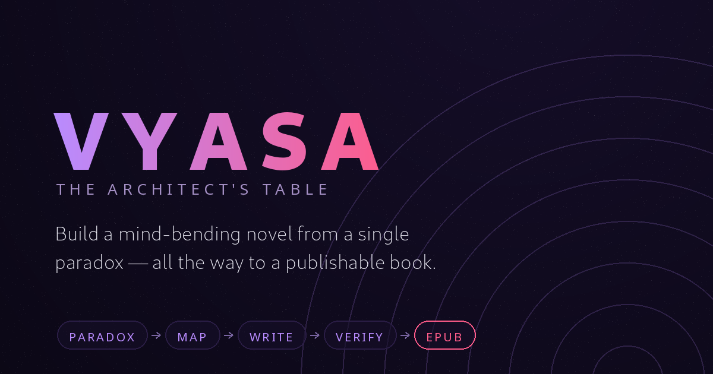

# 🌀 Vyasa — The Architect's Table

<p align="center">
  <a href="https://github.com/KdarshUchiha/vyasa/stargazers"></a>
  <a href="https://github.com/KdarshUchiha/vyasa/blob/main/LICENSE"></a>
  <a href="https://kdarshuchiha.github.io/vyasa/"></a>
  
  
</p>

> **A genre-reactive creative instrument for mind-bending novels & screenplays.**
> Not a prompt box. The interface *is* the co-architect — the whole environment bends to the story you're building.

<p align="center">
  <a href="https://kdarshuchiha.github.io/vyasa/">🌐 Open the Table</a> •
  <a href="GUIDE.md">📖 Read the Guide</a>
</p>

<p align="center">
  
</p>

---

## What it is

You don't "start a project." You cross a **threshold** by naming the world you'll bend —
**Sci-Fi · Horror · Thriller · Fantasy** — and the entire instrument re-skins live:
palette, typography, motion, film-grain, even the voice Vyasa speaks in.

Then you move through **five chambers** — from first spark to a publishable ebook —
while a single, persistent **Story Bible** remembers everything so the maze stays coherent.

| Chamber | Phase | What you do |
|---|---|---|
| 🌀 **Genesis** | The Genesis of Disorientation | Forge the **Central Paradox**, theme, and 1–2 unreliability mechanisms (capped — restraint is enforced). Or seed it all from a single **logline**. |
| 🗺️ **The Map** | The Labyrinth's Blueprint | A **two-track timeline** — chronology vs. reader-order, threaded — with a **Reveal Tension** meter and **The Reader's Mind** simulator (what they *believe* vs. what's *true*). |
| 🎭 **The Desk** | Crafting the Illusion | Write scene by scene, while the **contradiction engine** checks each scene against your **Canon Ledger** and **rules of the anomaly** — and lets you **Resolve** or mark **By Design**. |
| 📢 **Launch** | Launching the Labyrinth | Blurb, cover brief, comps & keywords — then **bind the manuscript** to HTML / Markdown / plain-text. |
| 🗝️ **The Keystone** | Lock the Labyrinth | A readiness scorecard + verdict across every phase, the complete **Codex**, and a real **EPUB** export ready for Kindle / KDP. |

### The ideas that make it different

1. **Genre-reactive theming.** The tool doesn't just *hold* your genre — it *becomes* it.
2. **A consistency engine, not a notepad.** A **Canon Ledger** (your story's memory) + enforceable
   **rules** + a per-scene **contradiction scanner** keep your absurdity *designed*, never accidental.
   Vyasa keeps the rules so your reader gets lost — and you never do.
3. **Idea → publishable book.** It closes the whole loop: seed, structure, write, verify, and export
   a valid **EPUB3** you can upload straight to a store — assembled entirely in your browser.

### More it does

- **The Reader's Mind** — step through your story and see the gap between what the reader believes
  and what's true; catch dramatic irony *exactly where you want it*.
- **The Vault** 🛡 — named snapshots + a rolling autosave safety net; restore any version, import/export.
- **Scenes** — a real chapter list; contradictions name the exact scene they came from.
- **Two example stories** in [`examples/`](examples/) — a small file to test contradiction-catching,
  and *The Cartographer's Confession*, a complete 15-chapter novelette to test the full book + EPUB pipeline.

---

## Run it

It's a single self-contained HTML file. No build, no install, no backend.

```bash
# just open it
open index.html            # macOS
xdg-open index.html        # Linux

# or serve locally
python3 -m http.server 3000
```

Your **Story Bible** persists in the browser (localStorage), is snapshotted in the **Vault**,
and exports to JSON any time. Everything — including the EPUB — is generated client-side; there
is no server and nothing leaves your machine.

Prefer not to start from scratch? Open the **Vault → Import** and load one of the
[`examples/`](examples/) bibles to explore a finished story.

## The Muse (optional AI co-writer)

Bring your **own** API key (Gemini or Groq). It stays in *your* browser and is sent only to
the provider you choose — never to any Vyasa server (there isn't one). The Muse can conjure a
whole bible from a **logline**, suggest paradoxes, non-linear beats, dialogues of doubt, blurbs,
and cover concepts, and run a **Deep Scan** that reads your prose against the canon for subtler
contradictions than the offline engine can catch.

---

## For screenwriters

Building your next film the way Nolan builds a puzzle? Vyasa treats a screenplay as a labyrinth
too — anchor the paradox, drag your reveals out of chronological order, and let the Desk guard
your time-loop rules while you write.

## License

MIT © KdarshUchiha
